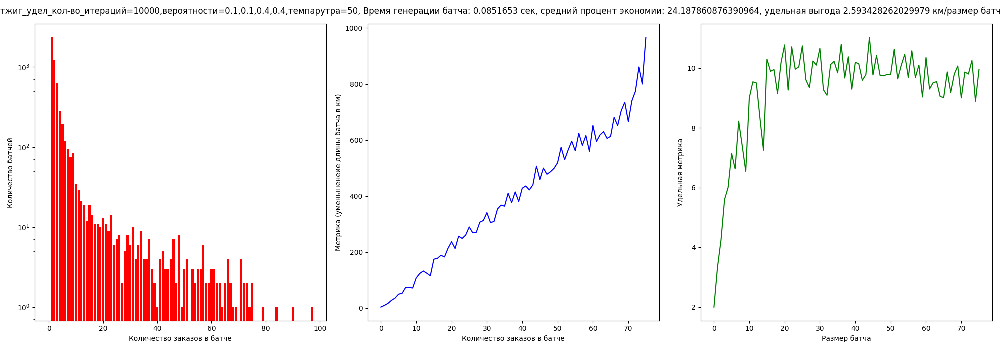

# Генерация батчей
[Описание проекта](https://docs.yandex.ru/docs/view?url=ya-disk-public%3A%2F%2F5Ug1yOeAqwdt0rjzfBbdZ%2FyVDCSvktl2%2FLo1fpjodT7hRyVqJj7J%2FCxw3FLbn7rAq%2FJ6bpmRyOJonT3VoXnDag%3D%3D&name=59.%20Генерация%20батчей%20через%20алгоритмы.docx&nosw=1)
[Презентация с защиты](https://docs.google.com/presentation/d/1Sp-0t9AJnPz0M1TfJb3rtNETaALYdLTxnksQ9ioVO9I/edit#slide=id.g2a9dc735dd5_1_92)

Были реализованы алгоритмы [имитации отжига](simulated_annealing) с эвристикамии центра масс и разными оптимизируемыми функциями на языке C++, а также сбор [статистики](testing) для разных алгоритмов и [визулизация](visualize) на карте Москвы

Лучший результат: 

Результат Яндекса: 